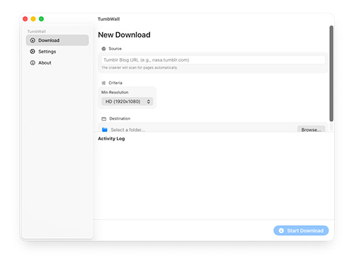

# TumbWall

TumbWall is a native macOS application designed to massively download images from Tumblr blogs, featuring advanced improved resolution filtering options.

## Table of Contents

1.  [Overview & Features](#overview--features)
2.  [User Guide](#user-guide)
    *   [Installation & Gatekeeper](#installation--gatekeeper)
    *   [Usage Instructions](#usage-instructions)
3.  [Developer Guide](#developer-guide)
    *   [Architecture](#architecture)
    *   [Dependencies](#dependencies)
    *   [Permissions & Sandboxing](#permissions--sandboxing)
4.  [License](#license)

---

## Overview & Features

TumbWall allows archivists and designers to efficiently download high-quality visual content.

### Key Features

*   **Hybrid Download Engine**: Supports both the official Tumblr API and a "Scraper" mode for blogs that don't require an API Key.
*   **Resolution Filtering**:
    *   Presets: HD (1920x1080), 4K (3840x2160).
    *   Custom Resolution: Define your own width and height limits.
*   **Smart Validation**: Images are validated post-download to ensure they meet size requirements; if not, they are automatically deleted.
*   **Modern Interface**: Designed with SwiftUI, following macOS style guidelines.
*   **Concurrency**: Configurable simultaneous downloads to maximize bandwidth.

---

## User Guide

### Installation & Gatekeeper

Since this application is not signed with an Apple Developer Certificate (it's an open-source project), macOS will block its execution by default. Follow these steps to open it:

1.  Download the latest version from the [Releases](https://github.com/jsanchez0x/TumbWall/releases) section.
2.  Unzip the `.zip` file and move `TumbWall.app` to your **Applications** folder.
3.  **First Launch**:
    *   **Right-click** (or Control + Click) on the app icon.
    *   Select **Open** from the context menu.
    *   A warning window will appear. Click **Open** again.
    *   *Note*: You only need to do this the first time.

### Usage Instructions

1.  **Configuration (Optional)**:
    *   Go to `TumbWall` > `Settings` (or press `⌘,`).
    *   Enter your Tumblr **API Key** if you have one. If not, enable "Force Scraping".
    *   Adjust the number of simultaneous downloads in the "Network" tab.
2.  **Start Download**:
    *   Enter the blog URL (e.g., `art.tumblr.com` or `https://art.tumblr.com`).
    *   Select the destination folder.
    *   Choose the desired resolution (HD, 4K, or Custom).
    *   Click "Start Download".
3.  **Monitoring**:
    *   The progress bar will indicate advancement.
    *   The logs panel shows in real-time which files are being validated and saved.

---

## Developer Guide

### Architecture

The project follows an **MVVM (Model-View-ViewModel)** architecture with **Clean Architecture** principles.

*   **Views**: SwiftUI components (`MainView`, `SettingsView`, `AboutView`). They contain no business logic.
*   **ViewModels**: (`DownloadViewModel`) Manage UI state and coordinate download logic.
*   **Services**:
    *   `DownloadManager`: Singleton responsible for the download operation queue (`OperationQueue`).
    *   `TumblrAPIFetcher` / `ScraperFetcher`: Strategies for obtaining image URLs.
    *   `SettingsManager`: Persistence management with `UserDefaults`.

### Dependencies

The project uses **Swift Package Manager (SPM)** for dependency management:

*   **SwiftSoup**: Used by `ScraperFetcher` to parse HTML from blogs and extract image URLs when the API is not used.

### Permissions & Sandboxing

TumbWall is configured with **App Sandbox** enabled to comply with macOS security standards.

*   **Network (Client)**: Allows the app to connect to the internet to download images (`com.apple.security.network.client`).
*   **File Access (User Selected)**: Allows read/write access to folders the user explicitly selects (`com.apple.security.files.user-selected.read-write`).

---

## License

This project is licensed under the MIT License - see the [LICENSE](LICENSE) file for details.
